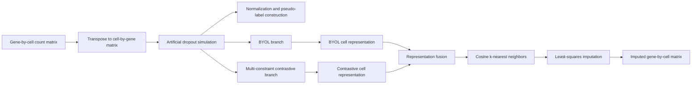

# DCLM-impute

**DCLM-impute** is a research implementation for single-cell RNA sequencing (scRNA-seq) data imputation. The framework learns complementary cell representations through two contrastive-learning branches and uses representation-guided neighboring cells to recover dropout values.

The current repository provides a reproducible example based on the **Zeisel** dataset and an artificial dropout experiment.

> **Repository status:** research code accompanying the DCLM-impute study. The current entry script is configured for a seven-cluster Zeisel experiment and should be adjusted before it is applied to another dataset.

---

## Overview

DCLM-impute combines:

1. a **multi-head self-attention branch** trained with instance-level contrastive learning and multiple auxiliary constraints;
2. a **BYOL branch** based on a multi-scale convolutional attention encoder;
3. a **representation fusion strategy** that combines the two learned cell embeddings;
4. a **cosine-similarity neighbor search** in the fused latent space;
5. a **least-squares imputation procedure** that estimates missing expression values from neighboring cells.

The implemented training objective of the first branch combines:

- instance-level contrastive loss;
- pseudo-label classification loss;
- zero-inflated negative binomial loss;
- reconstruction consistency loss.

## Workflow



## Repository structure

```text
DCLM-impute/
├── main.py                  # Example experiment and complete execution pipeline
├── models.py                # Self-attention, multi-scale encoder, and BYOL model
├── training.py              # Contrastive and BYOL training procedures
├── losses.py                # Contrastive, NB, ZINB, and cosine losses
├── augmentations.py         # Nonzero-entry masking augmentation
├── preprocessing.py         # Data loading, dropout simulation, normalization, and clustering
├── imputation.py            # Neighbor selection and least-squares imputation
├── Zeisel_top2000.csv       # Example expression matrix
├── Zeisel_cell_label.csv    # Zeisel cell annotations
└── __init__.py              # Currently contains notebook metadata; see release notes
```

## Requirements

A suggested environment is:

- Python 3.9–3.11
- PyTorch 2.0 or later
- NumPy
- pandas
- scikit-learn

Install the dependencies with:

```bash
pip install -r requirements.txt
```

For a CUDA-enabled installation of PyTorch, follow the installation command corresponding to your local CUDA version.

## Installation

```bash
git clone https://github.com/iwasto/DCLM-impute.git
cd DCLM-impute

python -m venv .venv
```

Activate the environment.

**Linux/macOS**

```bash
source .venv/bin/activate
```

**Windows PowerShell**

```powershell
.venv\Scripts\Activate.ps1
```

Then install the dependencies:

```bash
pip install -r requirements.txt
```

## Input data format

The input expression matrix must be a CSV file with:

- genes in rows;
- cells in columns;
- the first column containing gene identifiers;
- nonnegative expression/count values in the remaining entries.

Example:

```text
gene,cell_1,cell_2,cell_3
GeneA,0,3,1
GeneB,5,0,2
GeneC,0,1,0
```

`preprocessing.load_data()` reads this file and internally converts it to a cell-by-gene matrix.

## Quick start

### 1. Correct the example data path

The current `main.py` contains:

```python
groundTruth_data, cells, genes = load_data("Zeisel")
```

Because `load_data()` expects a CSV path, change it to:

```python
groundTruth_data, cells, genes = load_data("Zeisel_top2000.csv")
```

A recommended configuration block is:

```python
device = torch.device(
    "cuda" if torch.cuda.is_available() else "cpu"
)

dataset_name = "Zeisel"
data_path = "Zeisel_top2000.csv"
drop_rate = 0.1

groundTruth_data, cells, genes = load_data(data_path)
drop_data = impute_dropout(
    groundTruth_data,
    seed=42,
    drop_rate=drop_rate,
)
```

### 2. Run the example

```bash
python main.py
```

The script will:

1. load the expression matrix;
2. randomly mask a proportion of observed values;
3. generate pseudo-cluster labels;
4. train the BYOL branch;
5. train the multi-constraint contrastive branch;
6. fuse the two cell representations;
7. identify neighboring cells;
8. perform least-squares imputation;
9. save the masked and imputed matrices as CSV files.

## Main parameters

| Parameter | Current value | Description |
|---|---:|---|
| `drop_rate` | `0.1` | Fraction of observed entries masked in the artificial dropout experiment |
| `n_cluster` | `7` | Number of clusters used to construct pseudo-labels |
| `hidden_size` | `256` | Latent representation dimension |
| `epochs` | `100` | Number of training epochs for each branch |
| `aug_rate` | `0.4` | Fraction of nonzero values masked in each augmented view |
| `k` | `20` | Number of neighboring cells used for imputation |
| BYOL fusion coefficient | `0.25` | Weight of the BYOL representation in the fused embedding |
| `filter_noise` | `2` | Imputed values at or below this threshold are set to zero |

The first contrastive branch currently uses the following loss weights:

```text
0.4 × instance contrastive loss
0.3 × pseudo-label classification loss
0.2 × ZINB loss
0.1 × reconstruction consistency loss
```

## Applying DCLM-impute to another dataset

To use another dataset:

1. prepare a gene-by-cell CSV matrix;
2. set `data_path` to the new file;
3. set `n_cluster` to the expected number of cell groups;
4. update the classifier output dimension in `models.py`:

```python
nn.Linear(hidden_size, number_of_clusters)
```

5. adjust `k`, `hidden_size`, `epochs`, and `aug_rate` when necessary;
6. reduce the number of cells or use a memory-efficient attention implementation for very large datasets.

The current self-attention implementation constructs a cell-by-cell attention matrix. Its memory use therefore increases approximately quadratically with the number of cells.

## Reproducibility

For deterministic or approximately reproducible experiments, add the following before data processing and training:

```python
import random
import numpy as np
import torch

seed = 42
random.seed(seed)
np.random.seed(seed)
torch.manual_seed(seed)

if torch.cuda.is_available():
    torch.cuda.manual_seed_all(seed)

torch.backends.cudnn.deterministic = True
torch.backends.cudnn.benchmark = False
```

The artificial dropout function also accepts a `seed` argument:

```python
drop_data = impute_dropout(
    groundTruth_data,
    seed=seed,
    drop_rate=drop_rate,
)
```

## Output orientation

The model internally uses a cell-by-gene matrix. The saved matrices are transposed back to gene-by-cell orientation:

```python
pd.DataFrame(
    imputed_data.T,
    index=genes,
    columns=cells,
)
```

For clearer experiment tracking, use consistent output names:

```python
dropout_path = (
    f"{dataset_name}_dropout_{drop_rate:.1f}.csv"
)
imputed_path = (
    f"{dataset_name}_DCLM_imputed_{drop_rate:.1f}.csv"
)
```

## Important implementation notes

- The current example is configured for seven clusters.
- The classification head in `models.py` is also fixed to seven output classes.
- The current `main.py` uses the CPU by default.
- The example output filename `impute_0.4.csv` is inconsistent with the default `drop_rate=0.1`.
- If the least-squares system is singular, the current implementation switches to average-based imputation.
- The repository currently does not provide a command-line interface or automatic dataset configuration.
- The current `__init__.py` contains notebook JSON metadata rather than Python package initialization code.

See [`docs/USAGE_GUIDE_CN.md`](docs/USAGE_GUIDE_CN.md) for detailed Chinese instructions and [`docs/RELEASE_CHECKLIST_CN.md`](docs/RELEASE_CHECKLIST_CN.md) for recommended corrections before a formal software release.

## Citation

Please cite the associated DCLM-impute manuscript when using this code. The formal citation and BibTeX record can be added here after the paper is published.

A temporary repository citation can be written as:

```text
Fang, H. DCLM-impute: a dual-contrastive-learning framework for
single-cell RNA-seq data imputation. GitHub repository:
https://github.com/iwasto/DCLM-impute
```

## Contact

For questions concerning the implementation, experiments, or manuscript, please open a GitHub issue or contact the corresponding authors of the DCLM-impute study.

## License

A software license has not yet been specified in the current repository. Add an explicit license before formal public distribution or reuse.
